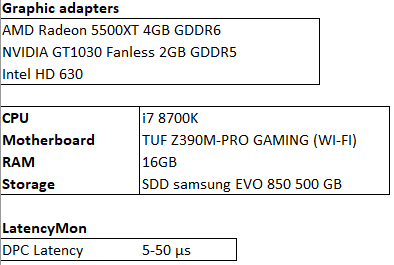
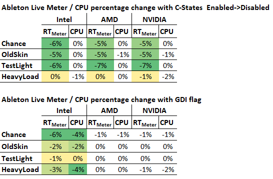
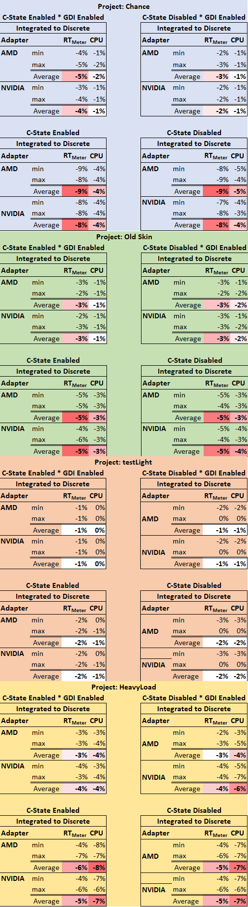
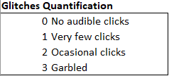
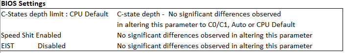
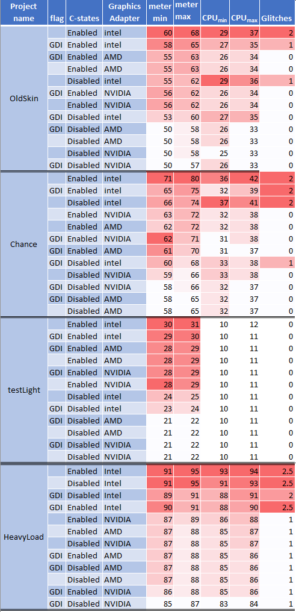
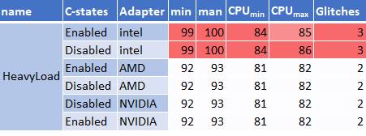

# State of Things: DAW Low Latency, C-States and Discrete vs. Integrated Graphics

*Originally published on [Gearspace](https://gearspace.com/threads/state-of-things-daw-low-latency-c-states-and-discrete-integrated-graphics-benchmark.1302028/), March 2020 (last edited April 2020).*

Thanks first to DAW PLUS, Vin and UnderTow on Gearspace, whose work helped clarify the almost inscrutable and ever-changing question of low-latency DAW behaviour and performance, and inspired these tests.

After some weeks of testing, these are my benchmark results. The premise, as discussed on Gearspace before, is that integrated graphics can and do affect VST performance in the DAW, both in the real-time meter readings and audibly, as glitches and crackles. I also tested the BIOS power-saving settings that throttle the processor: EIST, Speed Shift (since Skylake) and C-States.

## Test setup

- **CPU:** Intel i7 8700K (Coffee Lake)
- **RAM:** 16 GB
- **Storage:** SATA SSD
- **Audio interface:** RME Babyface Pro FS
- **Graphics adapters:**
  - AMD Radeon 5500XT 4GB GDDR6 (Adrenalin 2020 Edition 20.2.2)
  - NVIDIA GeForce GT 1030 Fanless 2GB GDDR5 (442.59)
  - Intel UHD Graphics 630, integrated (drivers 7870 – WDDM 2.6 and 7922 – WDDM 2.7, no visible differences)
- **OS:** Windows 10, version 1909, Ultimate Performance power plan, no further tuning
- **DAWs:** Ableton Live Suite 10.1.9 and PreSonus Studio One 4.6.0
- **Audio:** 64-sample buffer, 44.1 kHz / 24-bit

<figure>
  
  <figcaption>Test settings summary</figcaption>
</figure>

Ableton Live was tested more extensively, since all my music recordings of the past years were made with it, so I had projects at hand that reflect realistic use.

## Test projects

Two are large projects of mine, **OldSkin** and **Chance**. They use a fairly heterogeneous range of VSTs and VSTis: plenty of FabFilter Pro-Q and Pro-DS, Gullfoss, Pianoteq, Kontakt libraries, AmpliTube, Addictive Drums and Waves CLA plugins.

The other two were made specifically for testing. **HeavyLoad** is a mix of virtual instruments and audio tracks, duplicated until the audio garbled. **TestLight** represents a light-load context. The idea is to show the role of C-States and the related low-latency behaviour across low- and high-load situations.

You can listen to the two music projects on SoundCloud: [Old Skin](https://soundcloud.com/camplaix/projectox) and [Chance](https://soundcloud.com/camplaix/simao-piano).

## Results and discussion

### C-States

Under very high load, C-States matter less, because the load already keeps the processor at its full turbo clock. Under low load, it's a different story: with C-States enabled, the real-time meters get worse and fluctuate more. The CPU isn't pushed hard enough to run at its maximum frequency, which becomes a source of instability and a small performance penalty given the strict real-time demands of low buffer sizes (64 samples and below). This happens in both Ableton Live and Studio One.

### The obscure Ableton Live option flags

Ableton describes the `Options.txt` file as a way to enable experimental features in Live, mainly used for development and internal testing, though they may be useful to users too.

After a lot of searching and testing, I found one flag that matters here: `-_ForceGdiBackend`, which forces Live's GUI to use the older legacy GDI 2D framework. It comes up several times on the Ableton forums. With the flag enabled, performance improved consistently, but **only on the Intel integrated graphics**. Live then shows 0% GPU usage in Windows Task Manager, instead of the usual 8–10%.

My hypothesis is that lower GPU usage leaves the CPU less bandwidth-constrained, since the CPU and its integrated graphics share resources, which gives better performance and stability, as the results below show. With discrete graphics, the flag made a negligible difference, which supports the idea that the effect comes from that resource sharing under real-time-critical load.

### Integrated vs. discrete graphics

Beyond the C-State behaviour above, the results favour discrete graphics, with lower and more efficient resource usage. The difference shows mainly in the real-time component, reflected by the DAW meter, along with fewer audible glitches, which would otherwise appear earlier at lighter loads.

In the big scheme of things, this isn't a showstopper: I recorded both music projects on the integrated graphics over the past year, before my OCD kicked in and prompted this research. It also seems any discrete card does the trick, since there were no meaningful differences between AMD and NVIDIA.

## Percentage changes

Non-coloured fields are considered not to have changed significantly.

### C-States enabled → disabled, and the `-_ForceGdiBackend` flag

<figure>
  
  <figcaption>Ableton Live real-time meter and CPU change with C-States disabled (top) and with the GDI flag (bottom)</figcaption>
</figure>

### Switching from integrated to discrete graphics in different contexts

<figure>
  
  <figcaption>Integrated to discrete graphics, per project and setting</figcaption>
</figure>

## Measurements

I measured CPU usage and the DAW meters, both as percentages. Rows are sorted in descending order by the DAW real-time meter's highest value. Variations of 1–2% are not considered significant: most values stayed within that range, at least five observations were logged for each setting, and the values were averaged.

<figure>
  
  <figcaption>Glitch scale used in the results tables</figcaption>
</figure>

<figure>
  
  <figcaption>BIOS settings: changing C-State depth, Speed Shift or EIST made no significant difference</figcaption>
</figure>

### Ableton Live

<figure>
  
  <figcaption>DAW and CPU meter values in percentage</figcaption>
</figure>

### PreSonus Studio One

<figure>
  
  <figcaption>HeavyLoad project. DAW and CPU meter values in percentage</figcaption>
</figure>

## Notes from the discussion

- A Gearspace member pointed out that, according to Ableton, many Intel integrated GPUs have OpenGL problems, so Live blacklists a lot of them, and plugins that also use OpenGL (FabFilter, for example) then cause much higher load. You can check whether your GPU is blacklisted in Live's log file at `C:\Users\[username]\AppData\Roaming\Ableton\Live [version]\Preferences\Log.txt`. He saw this with a Haswell GPU.
- A friend of mine on a Haswell CPU solved all his Ableton problems just by enabling the `-_ForceGdiBackend` flag, so that GPU may well have been blacklisted.

---

[← Back to camplaix.github.io](https://camplaix.github.io/)
